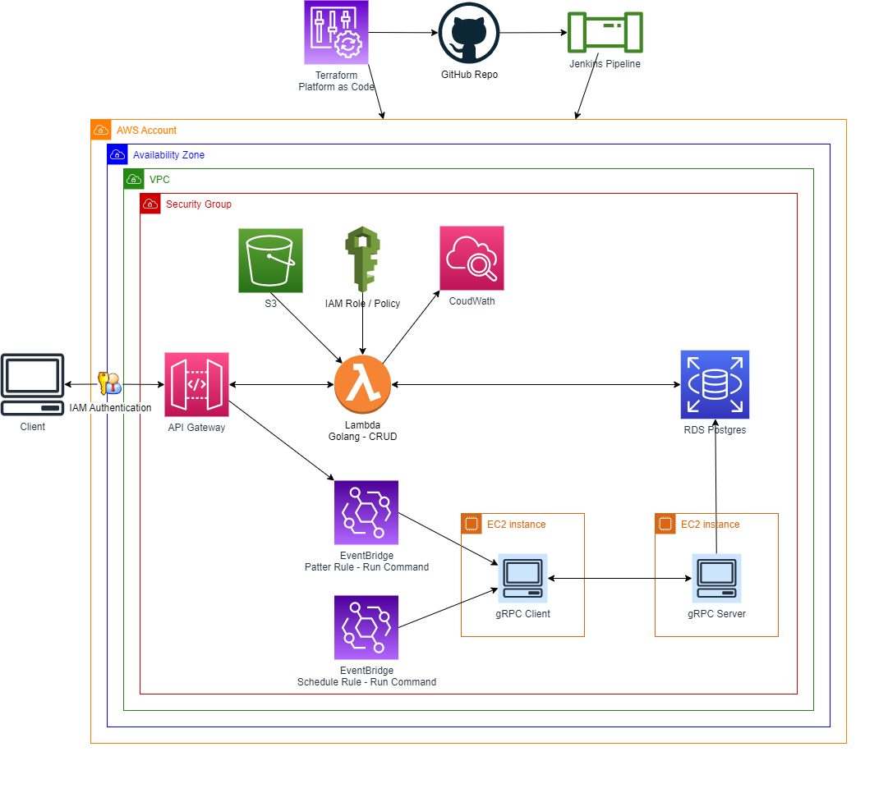

<!-- BEGIN_TF_DOCS -->
# Creating a backend microservices architecture with Golang and Terraform.

This repository aims to demonstrate how we can implement 3 different types of microservices in our backend projects. These 3 types of microservices are: lambda functions, RESTful microservices, and gRPC microservices.

We will be using AWS as our cloud platform. We will be using Golang as our programming language. Github will be our code repository. We will programmatically define the AWS infrastructure and services we will be implementing using Terraform.

We will also be using Terraform to deploy the infrastructure and functional code to the Development and Testing environments. For deploying the infrastructure and functional code to the Production environment, we will be using Jenkins.

## Definition of environments
For our project, we will define 3 types of environments: Development, Testing, and Production. Previously, we should have created 3 independent accounts within our Organization.

## Defining infrastructure with Terraform
The backbone for creating infrastructure resources is the <a href="main.tf" target="_blank">main.tf</a> file, which is located in the root folder. This file in turn refers to sub-files with specific content for configuring and creating resources. Configuration variables are located in the <a href="terraform.tfvars" target="_blank">terraform.tfvars</a> file.

## Network-level security
Within each account/environment, we will specify the availability zone we want to use. Within the default assigned Virtual Private Network, we will create a Security Group. 
This Security Group will allow us to define the inbound and outbound rules we need to interact with our infrastructure resources, such as Databases or EC2 instances.

## Terraform
Every single AWS Service in this lab has been created with Terraform sentences.
This lab demostrates the ability to update any AWS infrastructure with a platform as code approach with Terraform.
The only procedure we do manually is the creation of accounts, users, roles and key pairs with AWS IAM.

The ./main.tf file is the lab backbone. It links to submodules inside below subfolders:
- networking
- api_gateway
- db_postgresql
- microservices (lambda functions, gRPC)
- ec2

## Jenkins CI/CD 
The infraestructure updates and the Golang code can be automatically deployed with Terraform commands or with Jenkins Pipelines to DEV, QAT, NFT or PROD environments.
The Jenkins server has been created and configured manually on a AWS EC2 instance.
In this repo we just share screenshots of the Jenkins pipeline configuration (jenkins-config folder).
The Jenkins pipeline reads this Github repo and executes commands on a AWS account.
The Jenkins pipeline can be executed manually or configure to deploy code automatically (every hour, day, etc).

## AWS EC2 instances, Public IP, VPC, Security Group
In this lab we create two EC2 instances (client and server) for the purpose of deploying gRPC microservices in golang.
Each EC2 instance is associated to a public IP, VPC and security group. 
The security group is configure with ingress and egress rules.
Every suitable resource is created behind the same VPC and security group.

## AWS RDS Postgresql
In this lab we create one AWS RDS Postgresql database.
The DB model has two tables (companies and contacts).
All the DB resources are created with sql statements straight into the database (tables, relationsips, CRUD operations and load of test data).
We have two special sql functions: one for dynamic filtering and one for query pagination.
These CRUD functions are call by AWS Lambda functions.

## AWS API Gateway
The main purpose of this lab is to show how to create a microservices backend with AWS, lambda functions and gRPC functions written in Golang.
So the first step is to expose an API which is publicly available.

## AWS Eventbridge
AWS Eventbridge is used to orquestrate the integration between the AWS API Gateway and the gRPC services running in the EC2 instances.
A patern rule is created in EventBridge. Once the rule is satisfied, it executes a target Run Command (linux commands) into the EC2 to call a client gRPC function.
Also a schedule rule is created to execute a Run Command to execute a call to a client gRPC function.

## AWS Lambda Functions Golang microservices
The API invokes lambda functions written in golang to update DB contacts.
The lambda functions are secured with IAM authentication, so the client needs to send AWS Signature for authentication (AccessKey and SecretKey).
The lambda functions write detailed logs into the AWS CloudWatch event log.
The lambda functions execute the CRUD operations calling the in database functions.
The microservices can perform this operations:

- contacts delete by contact id
- contacts get by compamy id
- contacts get by contact id
- contacts get by dynamic filter
- contacts get by pagination
- contacts insert
- contacts update by contact id

## gRPC Golang microservices
Some API services are integrated to AWS EventBridge rules which fire gRPC functions running in a EC2 instance (client).
Once the client is invoked then it calls the corresponding gRPC function running in the EC2 server instance.
The microservices can perform this operations:

- usermgmt no persistence
- usermgmt in memory no persistence
- usermgmt json file persistence
- usermgmt db postgres persistence

https://www.linkedin.com/in/juanmanuel0963/