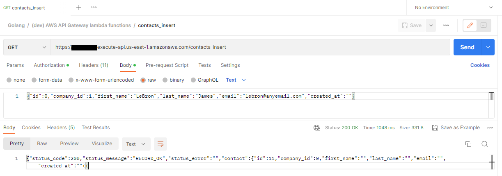
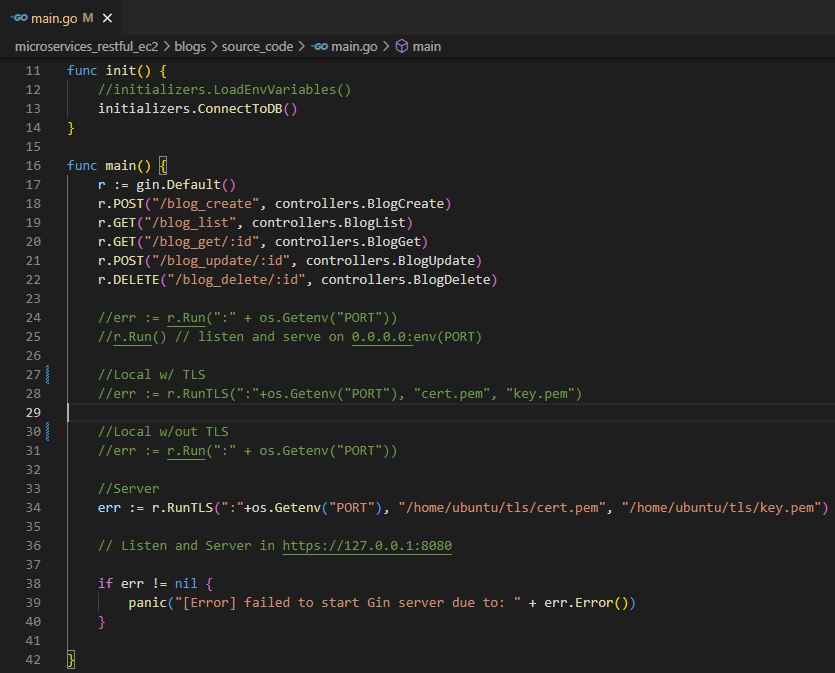
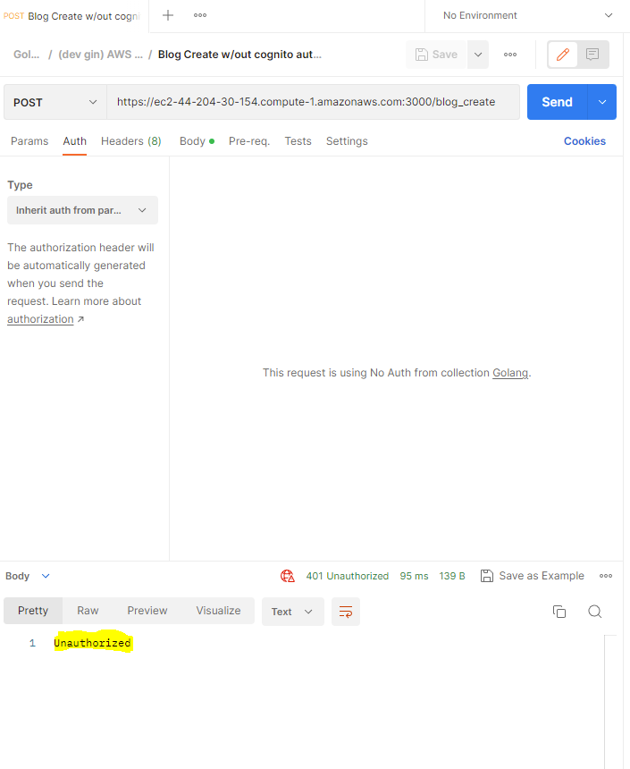
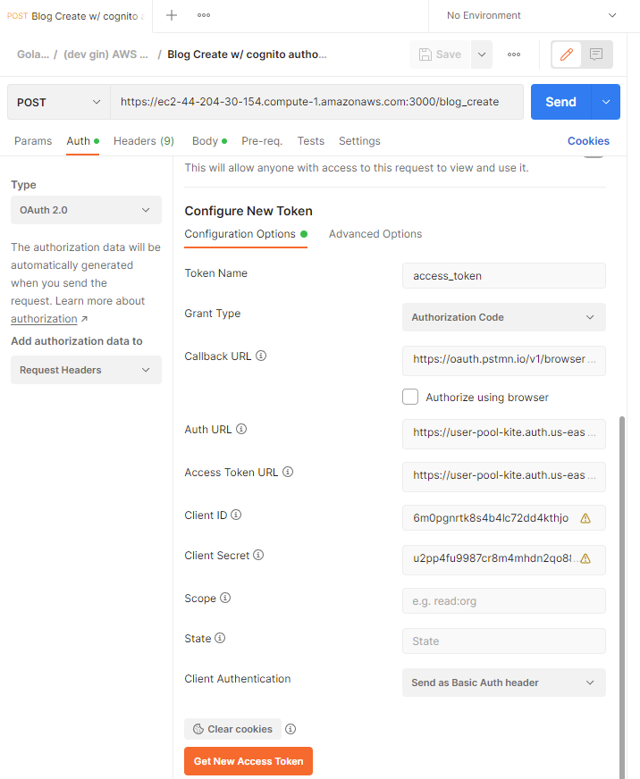
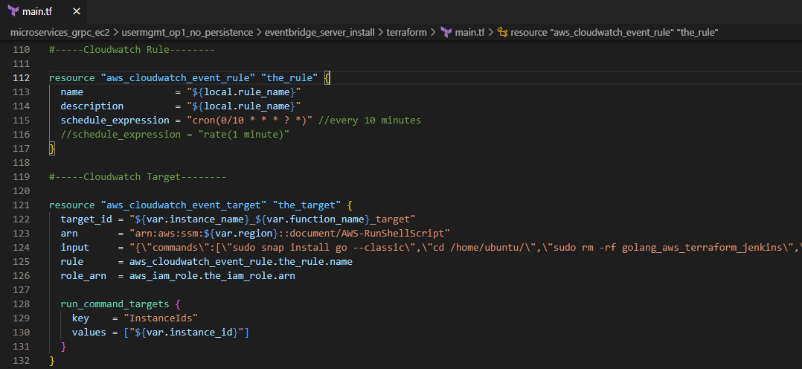

<!-- BEGIN_TF_DOCS -->
# Creating a backend microservices architecture with Terraform and Golang

This repository aims to demonstrate how we can implement 3 different types of microservices in our backend projects. These 3 types of microservices are: serverless lambda functions, server-based RESTful microservices, and server-based gRPC microservices.

Follow me:

 https://www.linkedin.com/in/juanmanuel0963/

We will be using AWS as our cloud platform. We will be using Golang as our programming language. Github will be our code repository. We will programmatically define the AWS infrastructure and services we will be implementing using Terraform.

We will also be using Terraform to deploy the infrastructure and functional code to the Development and Testing environments. For deploying the infrastructure and functional code to the Production environment, we will be using Jenkins.

## Defining deployment environments
For our project, we will define 3 types of environments: Development, Testing, and Production. Previously, we should have created 3 independent accounts within our Organization.

The creation of the Organization and the creation of Accounts are outside the scope of this guide.

## Defining infrastructure with Terraform
The backbone for creating infrastructure resources is the <a href="main.tf" target="_blank">main.tf</a> file, which is located in the root folder. This file in turn refers to sub-files with specific content for configuring and creating resources. Configuration variables are located in the <a href="terraform.tfvars" target="_blank">terraform.tfvars</a> file.

## Defining Network-level security
Within each account/environment, we will specify the availability zone we want to use. Within the default assigned Virtual Private Network, we will create a Security Group. 
This Security Group will allow us to define the inbound and outbound rules we need to interact with our infrastructure resources, such as Databases or EC2 instances.

<a href="main.tf" target="_blank">main.tf</a>

<a href="networking/terraform/main.tf" target="_blank">networking/terraform/main.tf</a>

## Creating the Postgresql database
We create the database within the same Security Group defined earlier. The configuration parameters, such as machine type, instance type, and allocated memory space, are brought from the terraform.tfvars file.

<a href="main.tf" target="_blank">main.tf</a>

<a href="db_postgresql/terraform/main.tf" target="_blank">db_postgresql/terraform/main.tf</a>

<a href="terraform.tfvars" target="_blank">terraform.tfvars</a>

Once Terraform has created the initial server and database, we create the "Companies" and "Contacts" tables, as well as the functions to perform CRUD operations on these tables. We do this by executing some sql scripts using a database IDE such as PgAdmin.

<a href="db_postgresql/source_code" target="_blank">db_postgresql/source_code</a>

We will use GORM for database resources definition when creating RESTful microservices and gRPC microservices.

## Creating the API Gateway 
The API Gateway will allow us to access a collection of microservices under the same domain name. In this project, the API Gateway will give us access to lambda functions to perform CRUD operations on a Contacts table.

<a href="main.tf" target="_blank">./main.tf</a>

<a href="api_gateway/terraform/main.tf" target="_blank">api_gateway/terraform/main.tf</a>

## Creating lambda functions. 
The next step is to create the lambda functions and associate them with the API Gateway we just created. We are going to create several functions int Golang to perform CRUD operations, as well as more specialized functions to perform searches through dynamic filters or paginated searches. The lambda functions that we will create and associate with the API Gateway are as follows:

&#x2022; contacts insert

&#x2022; contacts get by company id

&#x2022; contacts get by contact id

&#x2022; contacts delete by contact id

&#x2022; contacts update by contact id

&#x2022; contacts get by dynamic filter

&#x2022; contacts get by pagination

As always, everything starts with the main.tf file located in the root folder.

<a href="main.tf" target="_blank">main.tf</a>

<a href="microservices_restful_lambda/contacts_insert/terraform/main.tf" target="_blank">microservices_restful_lambda/contacts_insert/terraform/main.tf</a>

We use S3 buckets so that Terraform can upload the compiled executable code in a zip file and then migrate it to the lambda function. 

Previously, we must have compiled the source code into an executable file for the target operating system, in this case Linux.

We can compile the code into an executable file by invoking the following commands:

--before build binary to upload to AWS

    $Env:GOOS = "linux" 

--build

    go build main.go

## Lambda functions written in Golang: Contacts Insert

You can find the source code of the contacts insert function written in Golang in the following path:

<a href="microservices_restful_lambda/contacts_insert/source_code/main.go" target="_blank">microservices_restful_lambda/contacts_insert/source_code/main.go</a>

We add the libraries we will need to the import section. 

We define the "Contact" structure to obtain the data that is sent to the lambda function to later extract and insert it into the database

Likewise, we define the "ResponseBody" structure which will be returned by the lambda function informing the status of the transaction and the "Contact" with the new created Id.

The main() function is the entry point of the lambda function. However, it delegates the responsibility of processing by invoking the FunctionHandler handler. 

The first step that our handler performs is to obtain the message body and extract the data from the "Contact".

At certain control points, the function's execution sequence is logged in CloudWatch. If an error occurs, the details of the generated exception are recorded.

The next thing we do is to verify that the connection to the database is working properly.

We insert the data of the "Contact" into the database. In this example, we invoke a Postgresql database function.

Finally, the response body is prepared. The response is sent first to the API Gateway, which in turn returns a response to the client.

## Implementing IAM authentication & authorization in lambda functions

In order to allow only authorized clients to execute calls on our lambda functions, we previously added the function to the API Gateway in Terraform and indicated that the authorization type is "AWS_IAM".

<a href="microservices_restful_lambda/contacts_insert/source_code/main.go" target="_blank">microservices_restful_lambda/contacts_insert/source_code/main.go</a>

Once Terraform is executed, the following should appear in AWS:

Now we can create an IAM user with an associated policy that allows them to execute APIs.

This IAM user must be used as the authorization header in calls to the function.

## Testing lambda functions with Postman

In the following image, an example of a contacts_insert function invocation in Postman is shown. "AWS Signature" is specified as the authorization type, and the AccessKey and SecretKey created in IAM are entered.

## Creating EC2 Instance and configuring RESTful Server

Inside our RESTful server, we will have hosted 4 microservices with the following functions.

<b>Blogs</b>

&#x2022; blog create

&#x2022; blog list

&#x2022; blog get by id

&#x2022; blog update by id

&#x2022; blog delete by id

<b>Posts</b>

&#x2022; post create

&#x2022; post list

&#x2022; post get by id

&#x2022; post get by blog id

&#x2022; post get by dynamic filter

&#x2022; post get by pagination

&#x2022; post update by id

&#x2022; post delete by id

<b>Products</b>

&#x2022; product create

&#x2022; product list

&#x2022; product get by id

&#x2022; product get by invoice id

&#x2022; product update by id

&#x2022; product delete by id

<b>Invoices</b>

&#x2022; Invoice create

&#x2022; invoice list

&#x2022; invoice get by id

&#x2022; invoice update by id

&#x2022; invoice delete by id

We will create an EC2 instance to expose RESTful microservices using the following Terraform instructions.

<a href="main.tf" target="_blank">main.tf</a>

<a href="ec2/grpc_instance/terraform/main.tf" target="_blank">ec2/grpc_instance/terraform/main.tf</a>

The configuration parameters that we will use for the EC2 instance are found in the variables file.

<a href="terraform.tfvars" target="_blank">terraform.tfvars</a>

We create an EventBridge rule of type "Schedule"/"Run Command".

<a href="main.tf" target="_blank">main.tf</a>

This rule executes a cron job periodically. This EventBridge rule is responsible for downloading and installing from Github the latest updated version of the executable Golang code for the RESTful microservices.
This EventBridge rule is also responsible for generating a self-signed TLS certificate, in order to serve requests securely.

<a href="microservices_grpc_ec2/usermgmt_op1_no_persistence/eventbridge_client_install/terraform/main.tf" target="_blank">microservices_grpc_ec2/usermgmt_op1_no_persistence/eventbridge_client_install/terraform/main.tf</a>

Once we have the executable code installed, the next step is to start the service that will allow us to invoke the microservices from anywhere on the internet. For this, we start a GIN server for each microservice.

## Server-based RESTful microservice written Golang on EC2: Blogs management

Our Blog management microservice is implemented using the model-view-controller pattern.

The init() function initializes the connection to the Postgres database using the GORM connection driver.  

At the beginning of the main() function, the routes for invoking each of the microservice functions and the controller function responsible for each function are specified. 

The microservice is initialized on the GIN web server on a specific port and requires a TLS security certificate, which is generated and self-signed by the application itself.

<a href="microservices_restful_ec2/blogs/source_code/main.go" target="_blank">microservices_restful_ec2/blogs/source_code/main.go</a>

<a href="microservices_restful_ec2/_database/initializers/db_conn.go" target="_blank">microservices_restful_ec2/_database/initializers/db_conn.go</a>

<a href="microservices_restful_ec2/blogs/source_code/controllers/blog_controller.go" target="_blank">microservices_restful_ec2/blogs/source_code/controllers/blog_controller.go</a>

The VerifyToken() function extracts the token sent by the client and makes a connection to the Cognito authentication service created previously for our application. If the token is valid, the execution flow continues normally. If the token is not valid, the client cannot be authenticated and therefore cannot invoke the requested function.

<a href="cognito/auth_token/source_code/verify_token/verify_token.go" target="_blank">cognito/auth_token/source_code/verify_token/verify_token.go</a>

We can start the service by running the following command.

    sudo --preserve-env ./main

## Testing server-based RESTful microservices with Postman

Now that the microservice is up and listening on the specified port we can test connectivity with Postman.

The following image shows an example of an invocation in Postman to the function blog_create. As seen before, the microservice requires authentication with AWS Cognito. In this case, no authentication function is specified. As a response, the function sends an "Unauthorized" message.

In the following image, we see an example of an invocation of the blog_create function. In this case, we obtain and specify an AWS Cognito token. 

As a response, we get the ID and creation date of the blog. You can see that HTTPS was used to invoke the function. This is possible because the microservice generates a self-signed TLS security certificate.

## Creating EC2 instances and configuring gRPC client and server.

We will create a pair of EC2 instances in order to implement a client-server gRPC microservice architecture.

The microservice will contain the following 5 functions with different strategies for user creation and data persistence.

&#x2022; Sending client data to server without persistence function.

&#x2022; Sending client data to server with in-memory persistence.

&#x2022; Sending client data to server with JSON file persistence.

&#x2022; Sending client data to server with Postgresql database persistence.

&#x2022; Sending data from RESTful function to client and from client to server with Postgresql database persistence.

## Setting up gRPC Server

We will create an EC2 instance to expose gRPC server-side microservices using the following Terraform instructions.

<a href="main.tf" target="_blank">main.tf</a>

<a href="ec2/grpc_instance/terraform/main.tf" target="_blank">ec2/grpc_instance/terraform/main.tf</a>

We create an EventBridge rule of type "Schedule"/"Run Command".

<a href="main.tf" target="_blank">main.tf</a>

This rule executes a cron job periodically. This EventBridge rule is responsible for downloading and installing from Github the latest updated version of the executable Golang code for the gRPC microservice.

<a href="microservices_grpc_ec2/usermgmt_op1_no_persistence/eventbridge_server_install/terraform/main.tf" target="_blank">microservices_grpc_ec2/usermgmt_op1_no_persistence/eventbridge_server_install/terraform/main.tf</a>

The next step is to start the services for each of the gRPC server-side functions. We do this by executing an EventBridge rule of type "Schedule" / "Run Command". 

This rule runs a cron job periodically to ensure that the service is always active.

## Setting up gRPC Client

We will create an EC2 instance to expose gRPC client-side microservices using the following Terraform instructions.

<a href="main.tf" target="_blank">main.tf</a>

<a href="ec2/grpc_instance/terraform/main.tf" target="_blank">ec2/grpc_instance/terraform/main.tf</a>

We create an EventBridge rule of type "Schedule"/"Run Command".

<a href="main.tf" target="_blank">main.tf</a>

This rule executes a cron job periodically. This EventBridge rule is responsible for downloading and installing from Github the latest updated version of the executable Golang code for the gRPC microservice. This EventBridge rule is also responsible for generating a self-signed TLS certificate, in order to serve requests securely.

<a href="microservices_grpc_ec2/usermgmt_op1_no_persistence/eventbridge_client_install/terraform/main.tf" target="_blank">microservices_grpc_ec2/usermgmt_op1_no_persistence/eventbridge_client_install/terraform/main.tf</a>

The next step is to start the services for each of the gRPC client-side functions. We do this by executing an EventBridge rule of type "Schedule" / "Run Command". 

This rule runs a cron job periodically to ensure that the service is always active.

## gRPC microservice written in Golang on EC2: Users management

<b>gRPC server-side Golang code</b>

We add the necessary libraries to the import section. Specify the port on which the gRPC server-side microservice will be running. Create a structure with the variables we will need, such as the connection to the database and the user management proto buffer. Initialize the database connection using the GORM driver.

<a href="microservices_grpc_ec2/usermgmt_op4_db_postgres/usermgmt_server/usermgmt_server.go" target="_blank">microservices_grpc_ec2/usermgmt_op4_db_postgres/usermgmt_server/usermgmt_server.go</a>

The main() function initializes the variables of the structure and starts the service to run on the specified port.

Our gRPC user management microservice contains a function to create users. 

We can start up the service by executing the following command. However, this command is executed directly by Terraform as indicated earlier.

    sudo --preserve-env ./usermgmt_server

Now that the microservice is up and listening on the specified port, we can start the client service and send requests to the server.

<b>gRPC client-side Golang code</b>

