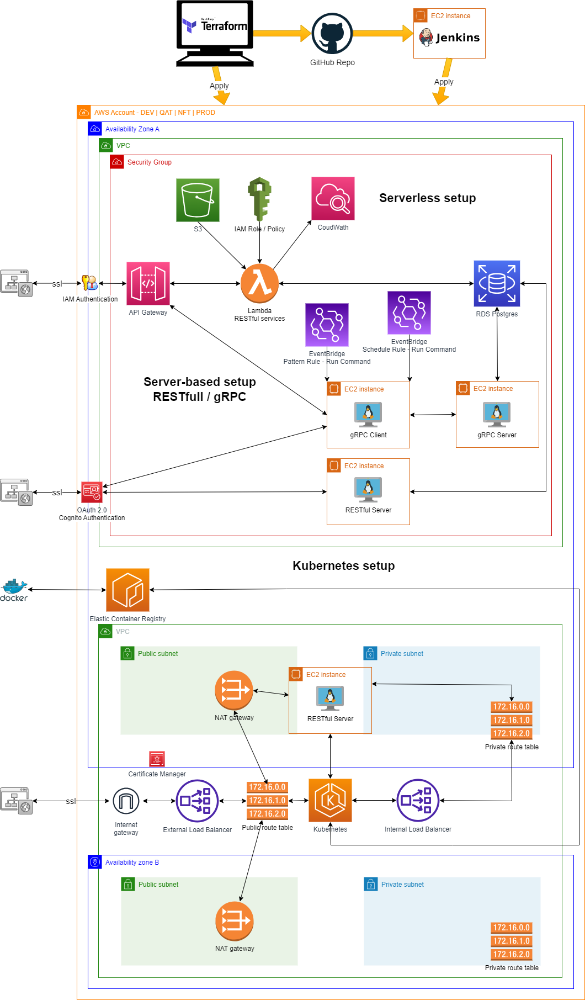
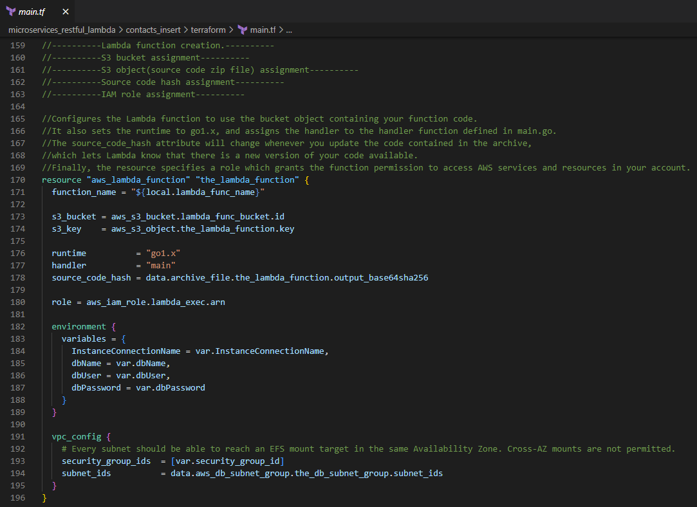

<!-- BEGIN_TF_DOCS -->
# Creating a backend microservices architecture with Terraform and Golang

This repository aims to demonstrate how we can implement 3 different types of microservices in our backend projects. These 3 types of microservices are: serverless lambda functions, server-based RESTful microservices, and server-based gRPC microservices.

Follow me:

 https://www.linkedin.com/in/juanmanuel0963/

We will be using AWS as our cloud platform. We will be using Golang as our programming language. Github will be our code repository. We will programmatically define the AWS infrastructure and services we will be implementing using Terraform.

We will also be using Terraform to deploy the infrastructure and functional code to the Development and Testing environments. For deploying the infrastructure and functional code to the Production environment, we will be using Jenkins.

## Defining deployment environments
For our project, we will define 3 types of environments: Development, Testing, and Production. Previously, we should have created 3 independent accounts within our Organization.

The creation of the Organization and the creation of Accounts are outside the scope of this guide.

## Defining infrastructure with Terraform
The backbone for creating infrastructure resources is the <a href="main.tf" target="_blank">main.tf</a> file, which is located in the root folder. This file in turn refers to sub-files with specific content for configuring and creating resources. Configuration variables are located in the <a href="terraform.tfvars" target="_blank">terraform.tfvars</a> file.

## Network-level security
Within each account/environment, we will specify the availability zone we want to use. Within the default assigned Virtual Private Network, we will create a Security Group. 
This Security Group will allow us to define the inbound and outbound rules we need to interact with our infrastructure resources, such as Databases or EC2 instances.

<a href="main.tf" target="_blank">main.tf</a>

<a href="networking/terraform/main.tf" target="_blank">networking/terraform/main.tf</a>

## Creating the Postgresql database
We create the database within the same Security Group defined earlier. The configuration parameters, such as machine type, instance type, and allocated memory space, are brought from the terraform.tfvars file.

<a href="main.tf" target="_blank">main.tf</a>

<a href="db_postgresql/terraform/main.tf" target="_blank">db_postgresql/terraform/main.tf</a>

<a href="terraform.tfvars" target="_blank">terraform.tfvars</a>

Once Terraform has created the initial server and database, we create the "Companies" and "Contacts" tables, as well as the functions to perform CRUD operations on these tables. We do this by executing some sql scripts using a database IDE such as PgAdmin.

<a href="db_postgresql/source_code" target="_blank">db_postgresql/source_code</a>

We will use GORM for database resources definition when creating RESTful microservices and gRPC microservices.

## Creating the API Gateway 
The API Gateway will allow us to access a collection of microservices under the same domain name. In this project, the API Gateway will give us access to lambda functions to perform CRUD operations on a Contacts table.

<a href="main.tf" target="_blank">./main.tf</a>

<a href="api_gateway/terraform/main.tf" target="_blank">api_gateway/terraform/main.tf</a>

## Creating lambda functions. 
The next step is to create the lambda functions and associate them with the API Gateway we just created. We are going to create several functions int Golang to perform CRUD operations, as well as more specialized functions to perform searches through dynamic filters or paginated searches. The lambda functions that we will create and associate with the API Gateway are as follows:

&#x2022; contacts insert

&#x2022; contacts get by company id

&#x2022; contacts get by contact id

&#x2022; contacts delete by contact id

&#x2022; contacts update by contact id

&#x2022; contacts get by dynamic filter

&#x2022; contacts get by pagination

As always, everything starts with the main.tf file located in the root folder.

<a href="main.tf" target="_blank">main.tf</a>

<a href="microservices_restful_lambda/contacts_insert/terraform/main.tf" target="_blank">microservices_restful_lambda/contacts_insert/terraform/main.tf</a>

## Contacts Insert: Lambda function written in Golang

You can find the source code of the contacts insert function written in Golang in the following path:

<a href="microservices_restful_lambda/contacts_insert/source_code/main.go" target="_blank">microservices_restful_lambda/contacts_insert/source_code/main.go</a>

We add the libraries we will need in the body of the function. 

We define the "Contact" structure to obtain the data that is sent to the lambda function to later extract and insert it into the database

Likewise, we define the "ResponseBody" structure which will be returned by the lambda function informing the status of the transaction and the "Contact" with the new created Id.

The main() function is the entry point of the lambda function. However, it delegates the responsibility of processing by invoking the FunctionHandler handler. 

The first step that our handler performs is to obtain the message body and extract the data from the "Contact".

At certain control points, the function's execution sequence is logged in CloudWatch. If an error occurs, the details of the generated exception are recorded.

The next thing we do is to verify that the connection to the database is working properly.

We insert the data of the "Contact" into the database. In this example, we invoke a Postgresql database function.

Finally, the response body is prepared. The response is sent first to the API Gateway, which in turn returns a response to the client.

## Implementation of authorization in lambda functions

In order to allow only authorized clients to execute calls on our lambda functions, we previously added the function to the API Gateway in Terraform and indicated that the authorization type is "AWS_IAM".

<a href="microservices_restful_lambda/contacts_insert/source_code/main.go" target="_blank">microservices_restful_lambda/contacts_insert/source_code/main.go</a>

Now we can create an IAM user with an associated policy that allows them to execute APIs.

This IAM user must be used as the authorization header in calls to the function.

